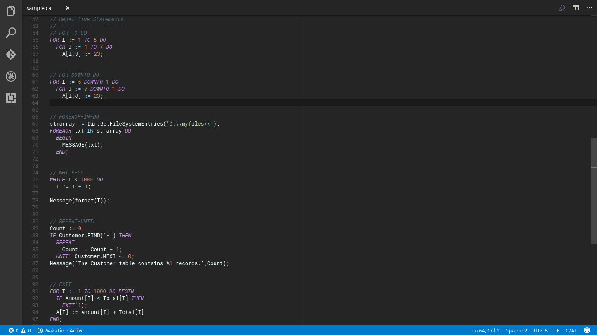

# Dynamic NAV C/AL for Visual Studio Code

[][1]
[![MIT License][2]][1] [![Microsoft Dynamics NAV C/AL][3]][1] [![Visual Studio Code][4]][1]

This plugin is intended to make development for Microsoft Dynamics NAV easier, away from it's ugly and non productive development environment. (Okay it's only my opinion)

## Features

The first feature that I'm developing is the syntaxhighlight. some other features are planned but are very tangled in my mind. I will put a TODO list for all those features.

## Requirements

For now there aren't any requeriments...

## Extension Settings

... and no settings ...

## Known Issues

... and a lot of issues ...

## Release Notes

### 0.0.9
- Corrections in support for operators

### 0.0.8
- Added support for language variables

### 0.0.7
- Added icon and theme for vs code marketplace

### 0.0.6
- Added support for BigIntegers, integers, decimal and datetime type
- Added builtin functions and data types
- Added arithmetic and logic operator

### 0.0.5
- Catch single lines commnets with double slash (//)

### 0.0.4
- I cant remember what I did here :/

### 0.0.3
- Complete list of control statments keyworks for C/AL in Dynamics NAV 2016
- Sample codes to test syntaxhigligth

### 0.0.2
- Update package.json
- Added github repository

### 0.0.1
- Nothing, I only starts this package

## Authors

* [@zodiacfireworks](https://github.com/zodiacfireworks)

## Licensing

All resources developed by me in this repository is released under the MIT license.

```text
    The MIT License

    Copyright (c) 2016 Martin Josemaría, http://zodiacfireworks.github.io/

    Permission is hereby granted, free of charge, to any person obtaining a copy
    of this software and associated documentation files (the "Software"), to deal
    in the Software without restriction, including without limitation the rights
    to use, copy, modify, merge, publish, distribute, sublicense, and/or sell
    copies of the Software, and to permit persons to whom the Software is
    furnished to do so, subject to the following conditions:

    The above copyright notice and this permission notice shall be included in
    all copies or substantial portions of the Software.

    THE SOFTWARE IS PROVIDED "AS IS", WITHOUT WARRANTY OF ANY KIND, EXPRESS OR
    IMPLIED, INCLUDING BUT NOT LIMITED TO THE WARRANTIES OF MERCHANTABILITY,
    FITNESS FOR A PARTICULAR PURPOSE AND NONINFRINGEMENT. IN NO EVENT SHALL THE
    AUTHORS OR COPYRIGHT HOLDERS BE LIABLE FOR ANY CLAIM, DAMAGES OR OTHER
    LIABILITY, WHETHER IN AN ACTION OF CONTRACT, TORT OR OTHERWISE, ARISING FROM,
    OUT OF OR IN CONNECTION WITH THE SOFTWARE OR THE USE OR OTHER DEALINGS IN
    THE SOFTWARE.
```

Resource with its respective licences are protectect by them.

If you find copyright protected content or without it respective credits, please let us know to give the respective credits and to put the things in order according to laws.


[1]: git@github.com:zodiacfireworks/vscode-c-al.git
[2]: https://img.shields.io/badge/License-MIT-blue.svg?maxAge=2592000&style=flat-square
[3]: https://img.shields.io/badge/Language-C/AL-blue.svg?maxAge=2592000&style=flat-square
[4]: https://img.shields.io/badge/Tool-Visual%20Studio%20Code-blue.svg?maxAge=2592000&style=flat-square
